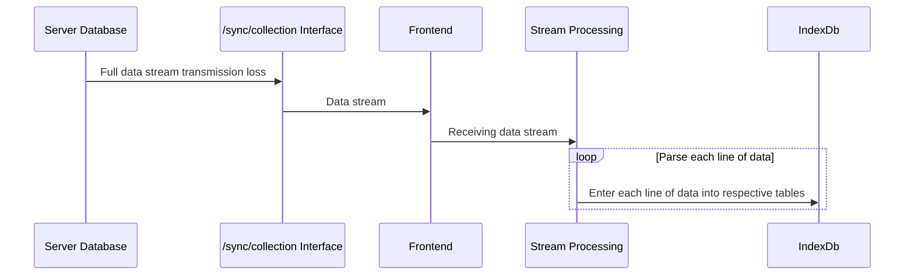
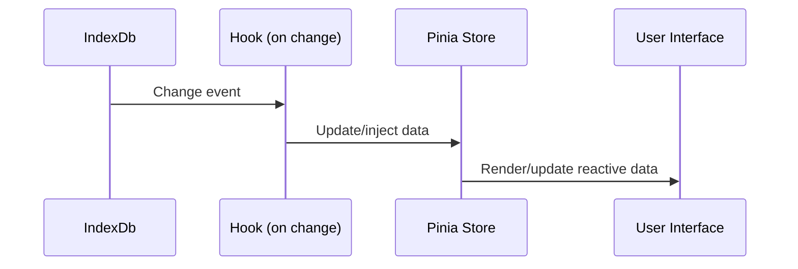
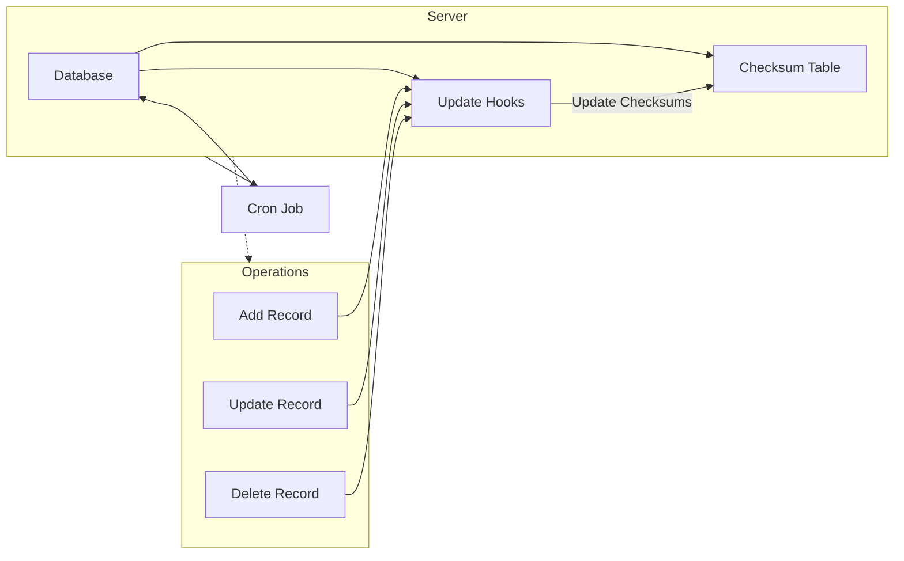

# D

A simple website. Written by Vue 3.

Data persistents in index DB, and local first after syncing but not using CRDTs.

## Structure

Establishing IndexDb for the first time.



Data binding with Pinia to implement UI reactivity.



Subsequent incremental updates.



<!-- 建立 /sync/deta 接口，接受一个上次同步完成的时间，根据这个时间查询这段时间的 db 更新记录，前端请求，增量更新 indexDb -->

```mermaid
sequenceDiagram
    participant Frontend
    participant /sync/deta API
    participant Database

    Frontend->>/sync/deta API: Request sync with last sync timestamp
    /sync/deta API->>Database: Query updates since last sync timestamp
    Database-->>/sync/deta API: Updated records
    /sync/deta API-->>Frontend: Updated records
    Frontend->>Frontend: Incrementally update indexDb with records
```
